# Go语言切片扩充流程

今天在网上学习了一下Go语言切片扩充的流程，觉得网上的文章用文字描述，
不是那么直观，而且许多文章已经过时了（或者说写得时候就是错的），所以自己在这总结一下。

## 网上一些文章的错误

Google搜了一下，网上有不少文章，例如[这篇](https://www.cnblogs.com/yahuian/p/go-slice-grow.html#:~:text=cap%20%E6%98%AF%E6%96%B0%E5%88%87%E7%89%87%E5%AE%B9%E9%87%8F%E7%9A%84%E6%9C%80%E5%B0%8F%E5%80%BC%EF%BC%88%E5%8D%B3%E6%97%A7%E5%88%87%E7%89%87%E7%9A%84%E5%AE%B9%E9%87%8F%E5%8A%A0%E4%B8%8A%E6%96%B0%E5%8A%A0%E5%85%A5%E5%85%83%E7%B4%A0%E7%9A%84%E6%95%B0%E9%87%8F%EF%BC%89%EF%BC%8C%E4%B8%8A%E9%9D%A2%E7%9A%84%E4%BE%8B%E5%AD%90%E4%B8%AD%EF%BC%8Ccap%20%E5%80%BC%E4%B8%BA%205%EF%BC%882%2B3%3D5%EF%BC%89)，
都在说[growslice函数](https://golang.org/src/runtime/slice.go#:~:text=func%20growslice(et%20*_type%2C%20old%20slice%2C%20cap%20int)%20slice)传入的参数`cap`是旧切片的**容量**加上新元素的数量。
但这里`cap`应该是旧切片的**长度**加上新元素的数量，也就是新切片的长度。
为什么我有这个看法，可以参见下面的[例子](#新切片长度小于旧切片容量的两倍且旧切片容量小于1024)，
其结果与这些文章中所说是矛盾的。

我想这些文章中的错误可能是来源于[这段代码](https://github.com/golang/go/commit/32fddadd98f938018485fba6253d30273db4e5e9#diff-fc52a9434e8f6cb1b87de5e565399f0d3e5efb448408f2e2e0ea3ea12de60550R44)中的`growslice_n`函数，不过现在这个函数已经不存在了。

## 流程图

先丢一个流程图。忽略溢出判断，简单的流程图如下所示：



下面写几个例子验证一下。这里使用的环境是Go Playground，写这篇文章时的Go版本是1.16.7。

## 新切片长度大于旧切片容量的两倍

执行下列代码：
```golang
package main

import (
	"fmt"
)

func main() {
	a := make([]int32, 2, 3)
	fmt.Println(len(a), cap(a))
	a = append(a, 3, 4, 5, 6, 7)
	fmt.Println(len(a), cap(a))
}
```

结果如下：
```
2 3
7 8
```

新切片的长度为7，旧切片容量为3，新切片的长度大于旧切片容量的两倍，
所以此时新切片容量就等于7，内存对齐后最终新切片容量为8，与结果相符。

## 新切片长度小于旧切片容量的两倍且旧切片容量小于1024

执行下列代码：
```golang
package main

import (
	"fmt"
)

func main() {
	a := make([]int32, 0, 3)
	fmt.Println(len(a), cap(a))
	a = append(a, 3, 4, 5, 6)
	fmt.Println(len(a), cap(a))
}
```


结果如下：
```
0 3
4 6
```

> cap 是新切片容量的最小值（即旧切片的容量加上新加入元素的数量）

如果按照那些文章中所说，参数`cap`是旧切片的容量加上新加入元素的数量，
那么上面这个例子中，旧切片的容量是3，新加入元素的数量是4，
cap就应该为7，因为7已经大于旧切片容量的两倍6，所以此时新切片容量就应该为7。
后面经过内存对齐，最终新切片容量应该是8，与输出结果不符。

如果按照上面我画的流程图，新切片的长度等于4，也就是小于旧切片容量的两倍，
此时因为旧切片容量为3，小于1024，所以新切片容量就等于两倍旧切片的容量，
也就是6，经过内存对齐，也还是6，与输出结果相符。

## 新切片长度小于旧切片容量的两倍且旧切片容量等于1024

执行下列代码：
```golang
package main

import (
	"fmt"
)

func main() {
	a := make([]int32, 1024)
	fmt.Println(len(a), cap(a))
	a = append(a, 3, 4, 5, 6)
	fmt.Println(len(a), cap(a))
}
```

结果如下：
```
1024 1024
1028 1344
```

按照我画的流程图，与输出结果也是相符的。

## 总结

网上说的也不可尽信，还是要自己多写一些例子跑一下，遇到不在意料之中的结果要探究一下背后的原因。
我写的内容如果有错误或者过时了，欢迎大家指出。