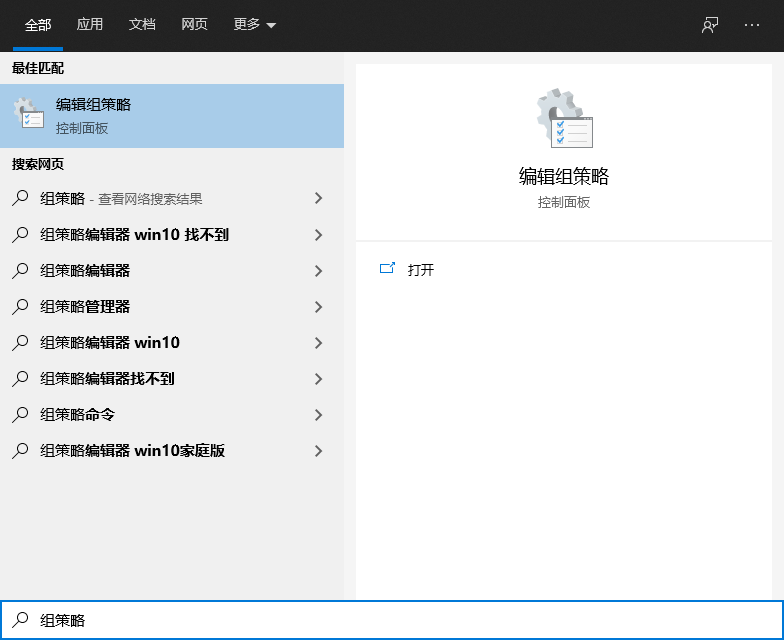
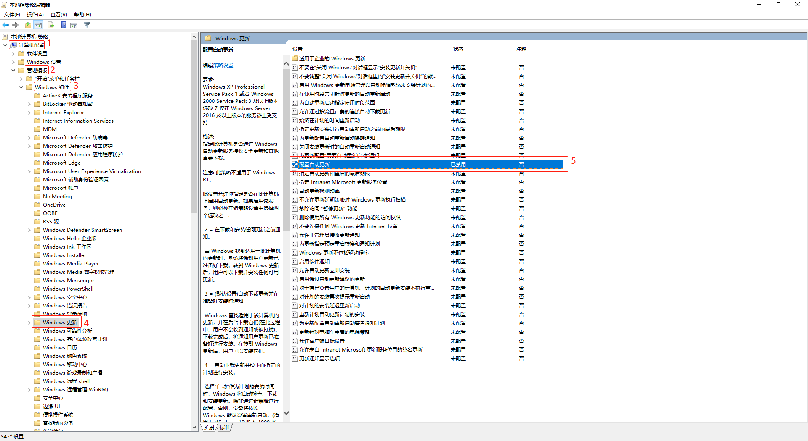

# 如何关闭Win10自动更新

网上有各种关闭Win10自动更新的方法，包括在“Windows 更新”界面暂停更新、将连接设为按流量计费等。这些方法都不是很好用，不是从根本上关闭自动更新。如果系统是Win10专业版或企业版，则可以通过组策略来彻底关闭Win10自动更新，方法如下：
1. 使用快捷键WIN+S打开搜索框，输入“组策略”，打开“编辑组策略” 
2. 依次打开“计算机配置”->“管理模板”->“Windows 组件”->“Windows 更新”，将右边列表中“配置自动更新”项改为“已禁用”就可以了，禁用后Win10将不会自动更新，但可以自己手动更新 
3. 除了关闭自动更新，列表中其它的设置项也可以根据自己的需求进行配置